<div align="center">



# 🛠️ CNC Simulator Pro

### Free, browser-based 3-axis CNC milling simulator with real-time G-code animation

Run a real CNC machine in your browser — watch material get cut away in 3D as your G-code executes. No installs, no signups, no fees. **100% client-side.**

[](https://rudra496.github.io/cnc/)
[](./LICENSE)
[](https://github.com/rudra496/cnc/stargazers)
[](https://nextjs.org/)
[](https://threejs.org/)
[](https://www.typescriptlang.org/)

**[🌐 Live Demo](https://rudra496.github.io/cnc/)** · **[⭐ Star this repo](https://github.com/rudra496/cnc/stargazers)** · **[🐛 Report a Bug](https://github.com/rudra496/cnc/issues)** · **[💬 Discussions](https://github.com/rudra496/cnc/discussions)**

</div>

---

> ⚡ **TL;DR** — CNC Simulator Pro is a professional-grade, **free and open-source** CNC milling simulator that runs entirely in your browser. It features a high-fidelity 3D machining center, real-time G-code visualization, a shop-style DRO control bar, a feeds & speeds calculator, and a complete learning suite for G-codes, M-codes, and tool management. Perfect for **students, machinists, hobbyists, educators, and anyone learning CNC programming.**

Built with **Next.js 16**, **react-three-fiber**, **Three.js**, **TypeScript**, **Tailwind CSS 4**, and **shadcn/ui**. Deploys to **GitHub Pages** as a static site.

---

## 📑 Table of Contents

- [Why CNC Simulator Pro?](#-why-cnc-simulator-pro)
- [Features](#-features)
- [Tool Library](#-tool-library-8-pre-configured-tools)
- [Material Library](#-material-library-8-materials)
- [Feeds & Speeds Calculator](#-feeds--speeds-calculator)
- [Try It Now](#-try-it-now)
- [Screenshots](#-screenshots)
- [Deploy to GitHub Pages](#-deploy-to-github-pages)
- [Local Development](#-local-development)
- [Keyboard Shortcuts](#-keyboard-shortcuts)
- [Project Structure](#-project-structure)
- [Tech Stack](#-tech-stack)
- [Roadmap](#-roadmap)
- [Contributing](#-contributing)
- [Community & Support](#-community--support)
- [License](#-license)

---

## 💡 Why CNC Simulator Pro?

Commercial CNC simulation software can cost **thousands of dollars** and requires powerful hardware. CNC Simulator Pro is built on the belief that **learning CNC should be free and accessible to everyone**, everywhere.

| | CNC Simulator Pro | Commercial Software |
|---|---|---|
| **Price** | 💯 Free forever | 💸 $$$ |
| **Install** | None — runs in browser | Heavy desktop app |
| **Platform** | Any device with a browser | Windows/Linux only |
| **Source code** | Open source (MIT) | Closed source |
| **Real 3D machining** | ✅ Yes | ✅ Yes |
| **G-code learning** | ✅ 65-code reference | Varies |

**Who is it for?**
- 🎓 **Students** learning CNC programming, manufacturing, or mechatronics
- 👨‍🏫 **Educators** teaching machining, G-code, or CAM concepts
- 🔧 **Machinists & engineers** prototyping and validating toolpaths
- 🛠️ **Hobbyists & makers** exploring CNC before buying a machine
- 💻 **Developers** studying real-time 3D simulation with Three.js

---

## ✨ Features

### 🎯 3D Machine & Simulation
- **High-fidelity gantry VMC** — base, table with T-slots, columns, moving bridge (Y), carriage (X), telescoping quill (Z), spindle motor, safety-glass enclosure
- **Real material removal** — a subdivided heightmap workpiece that gets *actually milled* as the tool follows the program
- **Per-tool geometry** — end mills, ball noses, drills, chamfers, face mills, spot drills and reamers each render their real shape and carve with their real diameter
- **Live toolpath** — cyan feed moves + amber dashed rapids, with arc tessellation
- **PBR materials, soft shadows, environment reflections, fog, infinite grid**
- **Camera presets** — Iso / Top / Front / Right / Reset, plus orbit / zoom

### 🎛️ Unique Advanced Control Bar
- **LCD-style DRO** — live X / Y / Z coordinates with cutting indicator
- **Status lamps** — spindle RPM, feed rate, active tool, coolant
- **Transport** — reset, step-back, play/pause, step-forward, single-block
- **Machine modes** — **Run** (full cut) / **Dry Run** (no material cut) / **Machine Lock** (toolpath preview only)
- **Optional stop (M01)** and **Block skip (/)** toggles
- **Timeline scrubber** with elapsed / remaining cycle time + block counter
- **Cycle speed** — 0.25× to 10× presets
- **Override knobs** — Feed / Rapid / Spindle % sliders that genuinely affect timing
- **Keyboard shortcuts** — `Space` play/pause, `←/→` step, `R` reset

### 💻 Manual G-code Programming
- **Full code editor** with syntax highlighting (color-coded G/M/T/F/S/X/Y/Z/I/J)
- **Line numbers + current-execution-line tracking** (highlights the block running in 3D)
- **Click-a-line-to-seek** — click any line to jump the simulation to that block
- **Parse diagnostics** — errors and warnings shown inline with line numbers
- **26 ready-to-run example programs** (Beginner → Advanced): circle pocket, square pocket, drilling, heart, spiral, "HI" engraving, grid pockets, gear, star, flower, face surfacing, hex pocket, cutter comp, circle bore, peck drill array, slot, island pocket, "CNC" engraving, dovetail, bolt circle, cam lobe, "2024", keyway, star burst, concentric rings, trophy base plate

### 🔧 Tool Library (8 pre-configured tools)
| T# | Tool | Diameter | Use |
|----|------|----------|-----|
| T1 | End Mill | Ø6 mm | General pockets, slots, profiles |
| T2 | End Mill | Ø10 mm | Roughing bigger features |
| T3 | Drill | Ø3 mm | Holes (G81/G83) |
| T4 | Ball Nose | Ø6 mm | 3D surfacing |
| T5 | Chamfer | Ø10 mm 90° | Edge breaking, spotting |
| T6 | Face Mill | Ø50 mm | Surfacing stock flat |
| T7 | Spot Drill | Ø8 mm | Accurate hole spotting |
| T8 | Reamer | Ø5 mm | Precision finished holes |

Each tool renders its real geometry and carves with its real diameter. The **Tools** tab shows all tools, highlights the active one, and marks which tools the current program uses.

### 🧱 Material Library (8 materials)
Aluminum 6061/7075, Mild Steel, Stainless 304, Brass, Copper, Delrin, Oak — each with recommended surface speed (Vc), chip load (fz), max depth of cut, and coolant recommendation. **Selecting a material changes the workpiece color in the 3D view.**

### 📐 Feeds & Speeds Calculator
Pick a tool + material, adjust axial/radial/feed overrides, and get live:
- **RPM** = (Vc × 1000) / (π × D)
- **Feed** = fz × flutes × RPM
- **MRR** (material removal rate, cm³/min)
- **Spindle power** estimate (kW)
- **Recommended DOC / WOC**
- Contextual warnings (rubbing risk, RPM cap, work-hardening, etc.)

### 💾 Program Library (save / load / export / import)
- **Save** the current editor content + workpiece to browser `localStorage`
- **Load** any saved program back into the editor
- **Download** a single program as a `.nc` file
- **Export All** / **Import** the entire library as JSON
- **15 code snippets** (header, tool change, circular pocket, drilling cycle, profile, finish pass, surfacing, etc.) — click to insert into the editor

### 📚 Comprehensive Learning
- **Reference tab** — 65 CNC codes (G/M/T/F/S/Z) with descriptions, examples, and tips, fully searchable and category-filtered
- **Guide tab** — how-to steps, G-code primer, coordinate system, programming tips, keyboard shortcuts

---

## 🚀 Try It Now

<div align="center">

### 👉 [**Open CNC Simulator Pro →**](https://rudra496.github.io/cnc/)

No download, no account, no setup. Pick an example program and hit ▶️ Play.

</div>

---

## 📸 Screenshots

> _Screenshots coming soon — in the meantime, [try the live demo](https://rudra496.github.io/cnc/) to see the 3D machine, control bar, editor, and material removal in action._

---

## 🚀 Deploy to GitHub Pages

This project is configured for **static export** and includes a GitHub Action that builds and deploys automatically.

### Option A — Automatic (recommended)

1. **Create a new GitHub repository** and push this project's source code to it:
   ```bash
   git init
   git add .
   git commit -m "CNC Simulator Pro"
   git branch -M main
   git remote add origin https://github.com/<YOUR_USERNAME>/<YOUR_REPO>.git
   git push -u origin main
   ```

2. **Enable GitHub Pages**: go to your repo → **Settings → Pages → Build and deployment → Source: GitHub Actions**.

3. The included workflow (`.github/workflows/deploy.yml`) will automatically build and deploy on every push to `main`. Wait ~2 minutes, then visit:
   ```
   https://<YOUR_USERNAME>.github.io/<YOUR_REPO>/
   ```

> The `basePath` is auto-detected from your repo name — no configuration needed.

### Option B — Manual build

```bash
bun install
# For a project page (username.github.io/REPO):
NEXT_PUBLIC_BASE_PATH="/REPO" bun run build
# For a user page (username.github.io):
bun run build
```
The static site is generated in `out/`. Upload the **contents** of `out/` to your `gh-pages` branch or the root of your GitHub Pages site. The `.nojekyll` file is included automatically.

---

## 🧑‍💻 Local Development

```bash
bun install
bun run dev      # http://localhost:3000
bun run lint     # ESLint check
```

Requirements: Node 18+ / Bun 1.0+.

---

## ⌨️ Keyboard Shortcuts

| Key | Action |
|-----|--------|
| `Space` | Play / Pause |
| `→` | Step forward one block |
| `←` | Step back one block |
| `R` | Reset to start |

---

## 🗂️ Project Structure

```
src/
├── app/
│   ├── layout.tsx          # Root layout + metadata
│   └── page.tsx            # Main page (3D viewport + tabbed panel + control bar)
├── components/
│   ├── cnc/
│   │   ├── CncScene.tsx        # 3D machine (react-three-fiber)
│   │   ├── ControlBar.tsx      # Controller console
│   │   ├── GCodeEditor.tsx     # Syntax-highlighted editor
│   │   ├── ProgramPanel.tsx    # Example selector + editor + diagnostics
│   │   ├── ProgramManager.tsx  # Save/load/export/import + snippets
│   │   ├── ToolManager.tsx     # Tool library browser
│   │   ├── MaterialPanel.tsx   # Material library selector
│   │   ├── FeedsCalculator.tsx # Feeds & speeds calculator
│   │   ├── CodeReference.tsx   # 65-code reference
│   │   ├── GuidePanel.tsx      # Educational guide
│   │   └── SceneOverlay.tsx    # 3D view toggles + camera presets
│   └── ui/                     # shadcn/ui components
└── lib/
    └── cnc/
        ├── parser.ts       # G-code interpreter
        ├── store.ts        # Zustand simulation store
        ├── carve.ts        # Workpiece carving engine
        ├── tools.ts        # 8-tool library
        ├── materials.ts    # 8-material library
        ├── feeds.ts        # Feeds & speeds math
        ├── reference.ts    # 65 CNC code entries
        ├── examples.ts     # 26 example programs
        ├── snippets.ts     # 15 code templates
        ├── programStore.ts # localStorage program manager
        ├── viewStore.ts    # View/camera options
        └── types.ts        # Shared types
```

---

## 🎨 Tech Stack

- **Next.js 16** (App Router, static export) · **TypeScript 5**
- **react-three-fiber** + **@react-three/drei** + **Three.js** — 3D rendering
- **Tailwind CSS 4** + **shadcn/ui** — UI components
- **Zustand** — simulation state · **react-resizable-panels** — layout
- **lucide-react** — icons

---

## 🗺️ Roadmap

- [x] High-fidelity 3D gantry VMC with real material removal
- [x] 26 example G-code programs (Beginner → Advanced)
- [x] DRO control bar with Run / Dry Run / Machine Lock modes
- [x] Feeds & speeds calculator
- [x] Tool & material libraries
- [x] 65-code G/M-code reference
- [x] Save / load / export programs locally
- [ ] 4th-axis (rotary) simulation
- [ ] STL/STEP stock import
- [ ] G-code export from CAM-style geometry
- [ ] Lathe / turning simulation
- [ ] Mobile-optimized touch controls

> Have an idea? [Open a discussion](https://github.com/rudra496/cnc/discussions) or [request a feature](https://github.com/rudra496/cnc/issues/new?labels=enhancement&template=feature_request.md)!

---

## 🤝 Contributing

Contributions are welcome and appreciated! Whether it's a bug fix, a new example program, a tool definition, documentation, or a feature — every contribution makes CNC learning more accessible.

1. **Fork** the repository
2. Create a feature branch: `git checkout -b feature/amazing-feature`
3. Commit your changes: `git commit -m 'Add amazing feature'`
4. Push to the branch: `git push origin feature/amazing-feature`
5. Open a **Pull Request**

See [**CONTRIBUTING.md**](./CONTRIBUTING.md) for detailed guidelines, and please read our [**Code of Conduct**](./CODE_OF_CONDUCT.md).

---

## 💬 Community & Support

<div align="center">

[](https://github.com/rudra496/cnc/discussions)
[](https://github.com/rudra496/cnc/issues)
[](https://github.com/rudra496/cnc/issues)

</div>

- 🐛 Found a bug? [Open an issue](https://github.com/rudra496/cnc/issues/new?labels=bug&template=bug_report.md)
- 💡 Have an idea? [Start a discussion](https://github.com/rudra496/cnc/discussions)
- ⭐ Like the project? [Star the repo](https://github.com/rudra496/cnc/stargazers) — it helps others discover it!
- 🔄 Share it with a machinist, student, or maker who'd love it.

---

## 📜 License

Released under the **MIT License** — see [LICENSE](./LICENSE). Free to use, modify, and share. Built for learning and experimentation.

---

<div align="center">

**Enjoy milling!** 🏭

Made with ❤️ by [**Rudra Sarker**](https://github.com/rudra496)

[🌐 Portfolio](https://rudra496.github.io/site) · [💻 GitHub](https://github.com/rudra496) · [💼 LinkedIn](https://www.linkedin.com/in/rudrasarker)

If CNC Simulator Pro helped you learn or teach CNC, please consider **⭐ starring** this repository and **sharing** it. It makes a real difference.

</div>
